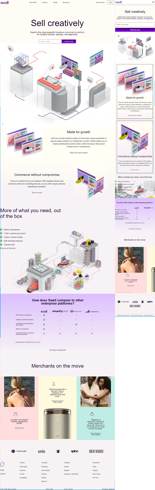

# swell
###Цель данного проекта - сверстать по макету из фигмы. Также самостоятельно сделал адаптив для данного макета. Использовал иконочный шрифт в качестве всех иконок на макете.
Верстка была сделана на чистом HTML+CSS(SASS/SCSS)+JavaScript.

